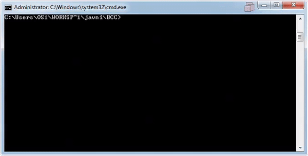

# femtoKernel
  
## Project Description
This project is a functional **multithreaded operating system kernel** with time sharing.   The kernel provides easy the user code with an easy to use api that supports:
* thread creation (created threads run concurrently)
* thread synchronization semaphores 
* interrupt handling.

The whole project was written from scratch, using only standard C++ libraries. Building the kernel requires version 3.1 of the Borland C++ Compiler from 1992. BCC provides an easy way to edit the interrupt vector table on MS DOS, which is required for the time sharing and interrupt handling functionalities.

The demo is showing 10 synchronized threads printing numbers 0-9. Other symbols are being generated using a keyboard event handler.

This project was completed in the summer of 2020 as part of the *Operating Systems 1* course at the University Of Belgrade School of Electrical Engineering (ETF). It has passed all tests and **received the maximum grade**. The full project requirements are available in the included PDF (Serbian only).

